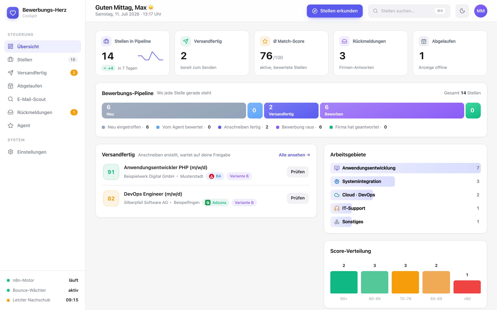
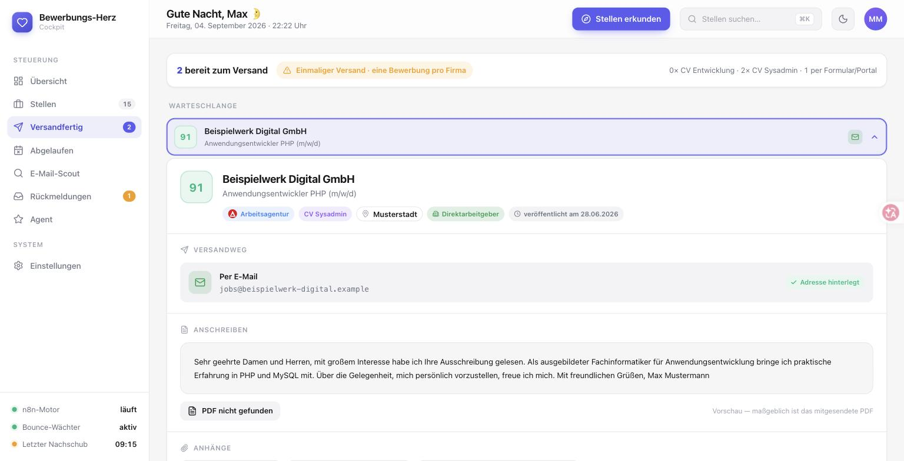
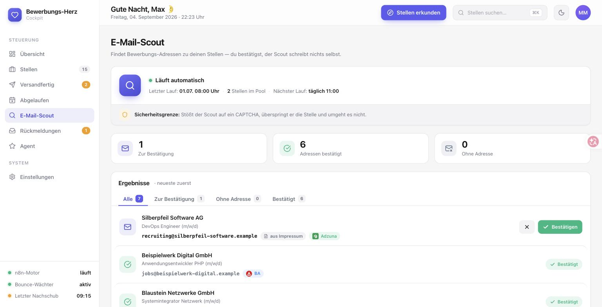
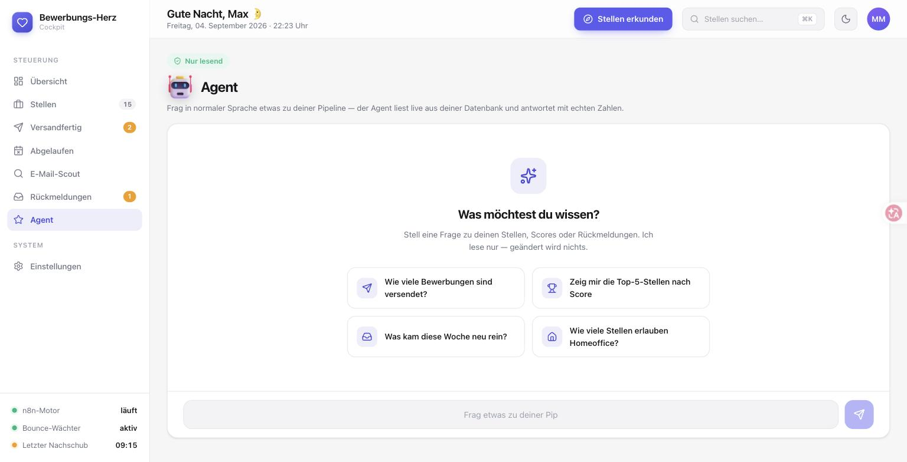
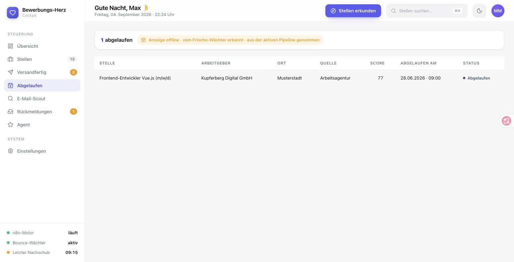
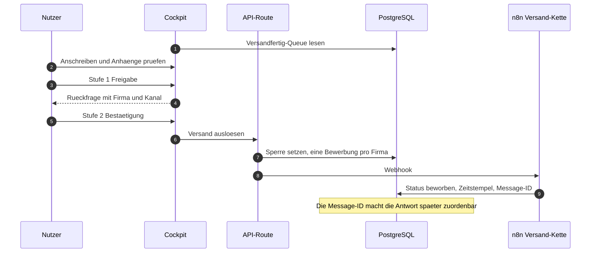
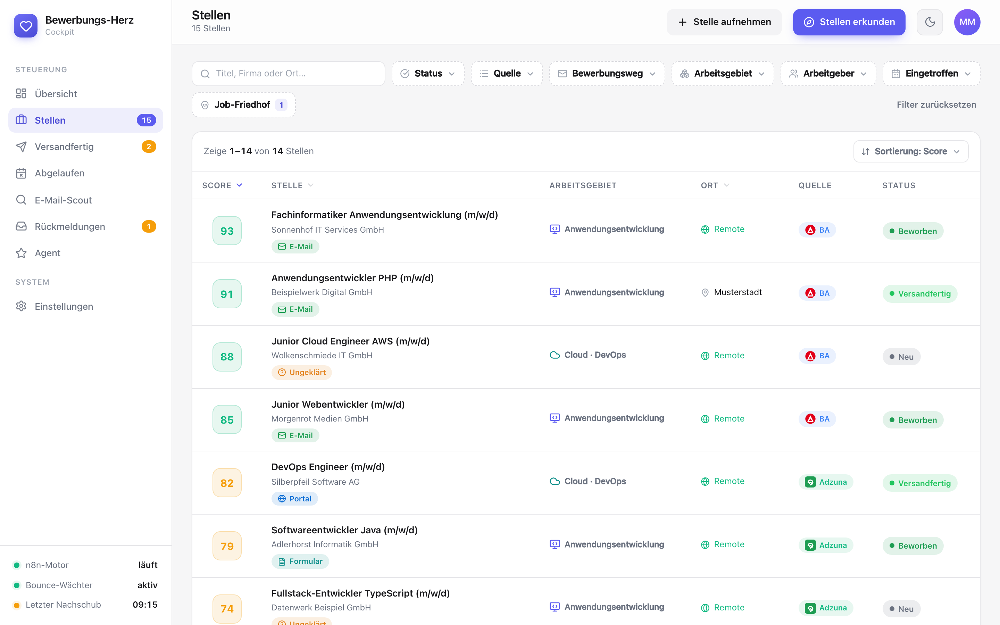
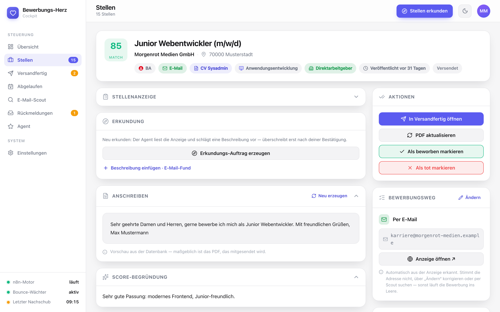
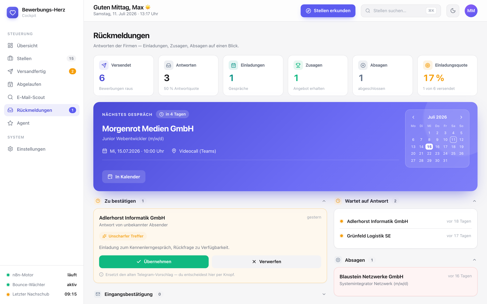

# Job Application Cockpit

Ein selbstgebautes Bewerbungs-Cockpit: verwaltet den kompletten Lebenszyklus von
Stellenanzeigen — vom automatischen Einsammeln über Scoring und Anschreiben bis
zu Versand und Rückmeldungs-Tracking — in einer Pipeline-Ansicht, als
installierbare PWA auch am Handy.

**Live-Demo:** <https://job-application-cockpit-demo.vercel.app> (Demo-Modus,
read-only — schreibende Aktionen sind deaktiviert)



## Die Oberflaeche

| Versandfertig-Queue | E-Mail-Scout |
|---|---|
|  |  |

| Agent-Chat | Job-Friedhof |
|---|---|
|  |  |

## Zwei-Stufen-Versand

Eine Bewerbung laesst sich nicht zurueckholen. Der Versand ist deshalb
bewusst umstaendlich gebaut.



## Entscheidungen, die ich bewusst getroffen habe

**Der Agent darf nur lesen.** Die Chat-Funktion uebersetzt Fragen in SQL. Statt
dem Modell zu vertrauen, laeuft jede erzeugte Abfrage gegen eine Whitelist:
nur SELECT und WITH, kein Semikolon, keine Mehrfachanweisung. Was nicht durch
das Gatter passt, wird nicht ausgefuehrt.

**Der Scout umgeht kein CAPTCHA.** Stoesst die Adress-Suche auf eine
Bot-Erkennung, ueberspringt sie die Stelle. Eine Grenze, die im Code steht und
in der Oberflaeche sichtbar ist.

**Eine Bewerbung pro Firma.** Die Sperre sitzt in der Datenbank, nicht in der
Oberflaeche. Zwei Anzeigen derselben Firma koennen nicht versehentlich zu zwei
Bewerbungen werden.

**Kein ORM.** Alle Zustandsuebergaenge sind parametrisierte SQL-Updates in
API-Routen. Das haelt die Schicht duenn und jeden Uebergang lesbar.

## Features

- **Pipeline-Übersicht** — KPIs, Pipeline-Band (Neu → Versandfertig → Beworben →
  Antwort), Nachschub-Chart und Score-Verteilung auf einen Blick
- **Stellen-Verwaltung** — sortier- und filterbare Liste (Status, Quelle,
  Bewerbungsweg, Arbeitsgebiet), manuelle Aufnahme neuer Stellen, Job-Friedhof
- **Stellen-Detailseite** — Anzeige, Score-Begründung, Anschreiben-Vorschau,
  Bewerbungsweg-Erkennung (E-Mail / Formular / Portal), Notizen, Dokumente
- **Versandfertig-Queue** — erstellte Anschreiben prüfen und mit
  Zwei-Stufen-Bestätigung versenden
- **Rückmeldungs-Tracking** — Einladungen, Zu- und Absagen mit Kalender,
  automatisch erkannte Antworten als bestätigbare Vorschläge
- **E-Mail-Scout & Erkundung** — gefundene Bewerbungsadressen und erkundete
  Stellenbeschreibungen landen als Vorschläge im Bestätigungs-Flow
- **Agent-Chat** — natürlichsprachliche Fragen an die eigene Pipeline,
  beantwortet über SQL-Abfragen (strikt read-only, SELECT/WITH-Whitelist)

| Stellenliste | Detailseite | Rückmeldungen |
|---|---|---|
|  |  |  |

## Architektur

```
Next.js 16 (App Router, Server Components)
   ├── PostgreSQL  ← einzige Datenquelle (Tabellen: stellen, bewerber_profil)
   └── n8n als Automations-Backend (optional, per Webhook entkoppelt)
        └── übernimmt Versand, PDF-Erzeugung, Posteingangs-Überwachung
```

Die App ist bewusst dünn gehalten: Alle Zustandsübergänge laufen über
parametrisierte SQL-Updates in API-Routen; langlaufende Automatisierung
(Stellen-Nachschub, Scoring, E-Mail-Versand) ist über Webhooks angebunden und
für den Betrieb der Oberfläche nicht erforderlich.

## Setup

```bash
npm install
cp .env.example .env.local        # Werte eintragen
createdb cockpit_demo             # oder bestehende Postgres nutzen
psql "$DATABASE_URL" -f sql/schema.sql
psql "$DATABASE_URL" -f sql/seed-demo.sql
npm run dev                       # http://localhost:3000
```

## Demo-Modus

Mit `DEMO_MODE=true` — oder automatisch, wenn keine Webhook-Variablen gesetzt
sind — blocken alle schreibenden API-Routen und antworten mit
`{ ok: false, demo: true }`; die Oberfläche zeigt dann einen Demo-Hinweis.
Lesende Ansichten laufen normal gegen die Seed-Daten. Für eine öffentlich
erreichbare Demo zusätzlich einen **read-only Datenbank-User** in der
`DATABASE_URL` verwenden.

## Tech-Stack

- Next.js 16 (App Router), React 19, TypeScript (strict)
- PostgreSQL über `pg` (ohne ORM, bewusst schlank)
- Tailwind CSS 4, lucide-react, TanStack Table
- PWA (Manifest + Icons, installierbar)

## Lizenz

MIT — siehe [LICENSE](LICENSE).
